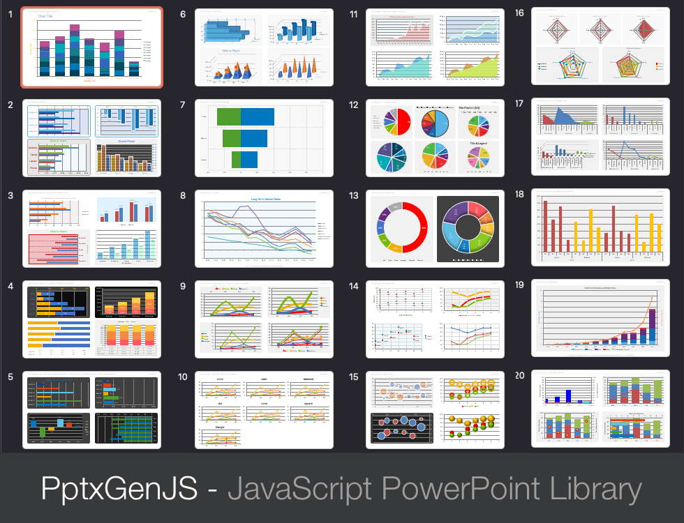

Charts of almost any type can be added to Slides. See [demos/modules/demo_chart.mjs](https://github.com/gitbrent/PptxGenJS/blob/master/demos/modules/demo_chart.mjs) for the charts shown below.



## Usage

```typescript
let pres = new pptxgen();
let dataChartAreaLine = [
	{
		name: "Actual Sales",
		labels: ["Jan", "Feb", "Mar", "Apr", "May", "Jun", "Jul", "Aug", "Sep", "Oct", "Nov", "Dec"],
		values: [1500, 4600, 5156, 3167, 8510, 8009, 6006, 7855, 12102, 12789, 10123, 15121],
	},
	{
		name: "Projected Sales",
		labels: ["Jan", "Feb", "Mar", "Apr", "May", "Jun", "Jul", "Aug", "Sep", "Oct", "Nov", "Dec"],
		values: [1000, 2600, 3456, 4567, 5010, 6009, 7006, 8855, 9102, 10789, 11123, 12121],
	},
];

slide.addChart(pres.ChartType.line, dataChartAreaLine, { x: 1, y: 1, w: 8, h: 4 });
```

### Core Chart Types

-   Chart type can be any one of `pptx.ChartType`
-   Currently: `pptx.ChartType.area`, `pptx.ChartType.bar`, `pptx.ChartType.bar3d`, `pptx.ChartType.bubble`, `pptx.ChartType.doughnut`, `pptx.ChartType.line`, `pptx.ChartType.pie`, `pptx.ChartType.radar`, `pptx.ChartType.scatter`

### Multi-Type Charts

-   Chart types can be any one of `pptx.ChartType`, although `pptx.ChartType.area`, `pptx.ChartType.bar`, and `pptx.ChartType.line` will give the best results.
-   There should be at least two chart-types. There should always be two value axes and category axes.
-   Multi Charts have a different function signature than standard. There are two parameters:
-   `chartTypes`: Array of objects, each with `type`, `data`, and `options` objects.
-   `options`: Standard options as used with single charts. Can include axes options.
-   Columns makes the most sense in general. Line charts cannot be rotated to match up with horizontal bars (a PowerPoint limitation).
-   Can optionally have a secondary value axis.
-   If there is secondary value axis, a secondary category axis is required in order to render, but currently always uses the primary labels. It is recommended to use `catAxisHidden: true` on the secondary category axis.
-   Standard options are used, and the chart-type-options are mixed in to each.

### Usage Notes

-   Zero values can be hidden using Microsoft formatting specs (see [Issue #288](https://github.com/gitbrent/PptxGenJS/issues/278))
-   Use `*LabelFormatCode` props to format numbers - see [Microsoft Number Format Codes](https://support.office.com/en-us/article/Number-format-codes-5026bbd6-04bc-48cd-bf33-80f18b4eae68)
-   Examples: The [`demos/modules/demo_chart.mjs`](https://github.com/gitbrent/PptxGenJS/blob/master/demos/modules/demo_chart.mjs) file has 17 slides of well-documented chart examples

## Properties

### Position/Size Props ([PositionProps](/PptxGenJS/docs/types#position-props))

| Option | Type   | Default | Description            | Possible Values                              |
| :----- | :----- | :------ | :--------------------- | :------------------------------------------- |
| `x`    | number | `1.0`   | hor location (inches)  | 0-n                                          |
| `x`    | string |         | hor location (percent) | 'n%'. (Ex: `{x:'50%'}` middle of the Slide)  |
| `y`    | number | `1.0`   | ver location (inches)  | 0-n                                          |
| `y`    | string |         | ver location (percent) | 'n%'. (Ex: `{y:'50%'}` middle of the Slide)  |
| `w`    | number | `1.0`   | width (inches)         | 0-n                                          |
| `w`    | string |         | width (percent)        | 'n%'. (Ex: `{w:'50%'}` 50% the Slide width)  |
| `h`    | number | `1.0`   | height (inches)        | 0-n                                          |
| `h`    | string |         | height (percent)       | 'n%'. (Ex: `{h:'50%'}` 50% the Slide height) |

### General (`IChartOpts`), Data Table (`IChartPropsDataTable`), Legend (`IChartPropsLegend`), Title (`IChartPropsTitle`)

| Option                    | Type    | Default    | Description                         | Possible Values                                                                                                                                                               |
| :------------------------ | :------ | :--------- | :---------------------------------- | :---------------------------------------------------------------------------------------------------------------------------------------------------------------------------- |
| `altText`                 | string  |            | chart alt text                      | string shown in the "alt text" panel in PowerPoint                                                                                                                            |
| `border`                  | object  |            | chart border                        | object with `pt` and `color` values. Ex: `border:{pt:'1', color:'f1f1f1'}`                                                                                                    |
| `chartColors`             | array   |            | data colors                         | array of hex color codes. Ex: `['0088CC','FFCC00']`                                                                                                                           |
| `chartColorsOpacity`      | number  | `100`      | data color opacity (percent)        | 1-100. Ex: `{ chartColorsOpacity:50 }`                                                                                                                                        |
| `dataTableFontSize`       | number  |            | data table font size                | 1-256. Ex: `{ dataTableFontSize: 13 }`                                                                                                                                        |
| `fill`                    | string  |            | fill/background color               | hex color code. Ex: `{ fill:'0088CC' }`                                                                                                                                       |
| `holeSize`                | number  | `50`       | doughnut hole size (percent)        | 1-100. Ex: `{ holeSize:50 }`                                                                                                                                                  |
| `invertedColors`          | array   |            | data colors for negative numbers    | array of hex color codes. Ex: `['0088CC','FFCC00']`                                                                                                                           |
| `legendFontFace`          | string  | `Arial`    | font face                           | font name. Ex: `{ legendFontFace:'Arial' }`                                                                                                                                   |
| `legendFontSize`          | number  | `10`       | legend font size                    | 1-256. Ex: `{ legendFontSize: 13 }`                                                                                                                                           |
| `legendColor`             | string  | `000000`   | legend text color                   | hex color code. Ex: `{ legendColor: '0088CC' }`                                                                                                                               |
| `legendPos`               | string  | `r`        | chart legend position               | `b` (bottom), `tr` (top-right), `l` (left), `r` (right), `t` (top)                                                                                                            |
| `layout`                  | object  |            | positioning plot within chart area  | object with `x`, `y`, `w` and `h` props, all in range 0-1 (proportionally related to the chart size). Ex: `{x: 0, y: 0, w: 1, h: 1}` fully expands chart within the plot area |
| `radarStyle`              | string  | `standard` | radar chart style                   | `standard`, `marker`, `filled`                                                                                                                                                |
| `showDataTable`           | boolean | `false`    | show Data Table under the chart     | `true` or `false` (Not available for Pie/Doughnut charts)                                                                                                                     |
| `showDataTableKeys`       | boolean | `true`     | show Data Table Keys (color blocks) | `true` or `false` (Not available for Pie/Doughnut charts)                                                                                                                     |
| `showDataTableHorzBorder` | boolean | `true`     | show Data Table horizontal borders  | `true` or `false` (Not available for Pie/Doughnut charts)                                                                                                                     |
| `showDataTableVertBorder` | boolean | `true`     | show Data Table vertical borders    | `true` or `false` (Not available for Pie/Doughnut charts)                                                                                                                     |
| `showDataTableOutline`    | boolean | `true`     | show Data Table table outline       | `true` or `false` (Not available for Pie/Doughnut charts)                                                                                                                     |
| `showLabel`               | boolean | `false`    | show data labels                    | `true` or `false`                                                                                                                                                             |
| `showLeaderLines`         | boolean | `false`    | show leader lines                   | `true` or `false`                                                                                                                                                             |
| `showLegend`              | boolean | `false`    | show chart legend                   | `true` or `false`                                                                                                                                                             |
| `showPercent`             | boolean | `false`    | show data percent                   | `true` or `false`                                                                                                                                                             |
| `showTitle`               | boolean | `false`    | show chart title                    | `true` or `false`                                                                                                                                                             |
| `showValue`               | boolean | `false`    | show data values                    | `true` or `false`                                                                                                                                                             |
| `title`                   | string  |            | chart title                         | Ex: `{ title:'Sales by Region' }`                                                                                                                                             |
| `titleAlign`              | string  | `center`   | chart title text align              | `left` `center` or `right` Ex: `{ titleAlign:'left' }`                                                                                                                        |
| `titleColor`              | string  | `000000`   | title color                         | hex color code. Ex: `{ titleColor:'0088CC' }`                                                                                                                                 |
| `titleFontFace`           | string  | `Arial`    | font face                           | font name. Ex: `{ titleFontFace:'Arial' }`                                                                                                                                    |
| `titleFontSize`           | number  | `18`       | font size                           | 1-256. Ex: `{ titleFontSize:12 }`                                                                                                                                             |
| `titlePos`                | object  |            | title position                      | object with x and y values. Ex: `{ titlePos:{x: 0, y: 10} }`                                                                                                                  |
| `titleRotate`             | integer |            | title rotation (degrees)            | 0-359. Ex: `{ titleRotate:45 }`                                                                                                                                               |

### Cat Axis (`IChartPropsAxisCat`) and Val Axis (`IChartPropsAxisVal`)

| Option                   | Type    | Default      | Description                      | Possible Values                                                                                                                    |
| :----------------------- | :------ | :----------- | :------------------------------- | :--------------------------------------------------------------------------------------------------------------------------------- |
| `catAxisBaseTimeUnit`    | string  |              | category-axis base time unit     | `days` `months` or `years`                                                                                                         |
| `catAxisHidden`          | boolean | `false`      | hide category-axis               | `true` or `false`                                                                                                                  |
| `catAxisLabelColor`      | string  | `000000`     | category-axis color              | hex color code. Ex: `{ catAxisLabelColor:'0088CC' }`                                                                               |
| `catAxisLabelFontBold`   | boolean | `false`      | make cat axis label bold         | `true` or `false`                                                                                                                  |
| `catAxisLabelFontFace`   | string  | `Arial`      | category-axis font face          | font name. Ex: `{ titleFontFace:'Arial' }`                                                                                         |
| `catAxisLabelFontSize`   | integer | `18`         | category-axis font size          | 1-256. Ex: `{ titleFontSize:12 }`                                                                                                  |
| `catAxisLabelFrequency`  | integer |              | PPT "Interval Between Labels"    | 1-n. Ex: `{ catAxisLabelFrequency: 2 }`                                                                                            |
| `catAxisLabelPos`        | string  | `nextTo`     | category-axis label position     | `low`, `high`, or `nextTo` . Ex: `{ catAxisLabelPos: 'low' }`                                                                      |
| `catAxisLabelRotate`     | integer |              | category-axis rotation (degrees) | 0-360. Ex: `{ catAxisLabelRotate:45 }`                                                                                             |
| `catAxisLineColor`       | string  | `000000`     | category-axis line color         | hex color code. Ex: `{ catAxisTitleColor:'0088CC' }`                                                                               |
| `catAxisLineShow`        | boolean | `true`       | show/hide category-axis line     | `true` or `false`                                                                                                                  |
| `catAxisLineSize`        | integer | `18`         | category-axis font size          | 1-256. Ex: `{ titleFontSize:12 }`                                                                                                  |
| `catAxisLineStyle`       | string  | `solid`      | category-axis line style         | `solid`, `dash`, `dot`                                                                                                             |
| `catAxisMajorTickMark`   | string  |              | category-axis major tick mark    | `none`, `inside`, `outside`, `cross`                                                                                               |
| `catAxisMajorTimeUnit`   | string  |              | category-axis major time unit    | `days`, `months` or `years`                                                                                                        |
| `catAxisMaxVal`          | integer |              | category-axis max value          | Integer. Ex: `{ catAxisMaxVal:10 }`                                                                                                |
| `catAxisMinVal`          | integer |              | category-axis min value          | Integer. Ex: `{ catAxisMinVal:0 }`                                                                                                 |
| `catAxisMinorTickMark`   | string  |              | category-axis minor tick mark    | `none`, `inside`, `outside`, `cross`                                                                                               |
| `catAxisMinorTimeUnit`   | string  |              | category-axis minor time unit    | `days`, `months` or `years`                                                                                                        |
| `catAxisMajorUnit`       | integer |              | category-axis major unit         | Positive integer. Ex: `{ catAxisMajorUnit:12 }`                                                                                    |
| `catAxisMinorUnit`       | integer |              | category-axis minor unit         | Positive integer. Ex: `{ catAxisMinorUnit:1 }`                                                                                     |
| `catAxisOrientation`     | string  | `minMax`     | category-axis orientation        | `maxMin` (high->low) or `minMax` (low->high)                                                                                       |
| `catAxisTitle`           | string  | `Axis Title` | axis title                       | a string. Ex: `{ catAxisTitle:'Regions' }`                                                                                         |
| `catAxisTitleColor`      | string  | `000000`     | title color                      | hex color code. Ex: `{ catAxisTitleColor:'0088CC' }`                                                                               |
| `catAxisTitleFontFace`   | string  | `Arial`      | font face                        | font name. Ex: `{ catAxisTitleFontFace:'Arial' }`                                                                                  |
| `catAxisTitleFontSize`   | integer |              | font size                        | 1-256. Ex: `{ catAxisTitleFontSize:12 }`                                                                                           |
| `catAxisTitleRotate`     | integer |              | title rotation (degrees)         | 0-360. Ex: `{ catAxisTitleRotate:45 }`                                                                                             |
| `catGridLine`            | object  | `none`       | category grid line style         | object with properties `size` (pt), `color` and `style` (`'solid'`, `'dash'` or `'dot'`) or `'none'` to hide                       |
| `showCatAxisTitle`       | boolean | `false`      | show category (vert) title       | `true` or `false`. Ex:`{ showCatAxisTitle:true }`                                                                                  |
| `showValAxisTitle`       | boolean | `false`      | show values (horiz) title        | `true` or `false`. Ex:`{ showValAxisTitle:true }`                                                                                  |
| `valAxisDisplayUnit`     | string  |              | display units                    | `billions`, `hundredMillions`, `hundreds`, `hundredThousands`, `millions`, `tenMillions`, `tenThousands`, `thousands`, `trillions` |
| `valAxisHidden`          | boolean | `false`      | hide value-axis                  | `true` or `false`                                                                                                                  |
| `valAxisLabelColor`      | string  | `000000`     | value-axis color                 | hex color code. Ex: `{ valAxisLabelColor:'0088CC' }`                                                                               |
| `valAxisLabelFontBold`   | boolean | `false`      | make val axis label bold         | `true` or `false`                                                                                                                  |
| `valAxisLabelFontFace`   | string  | `Arial`      | value-axis font face             | font name. Ex: `{ titleFontFace:'Arial' }`                                                                                         |
| `valAxisLabelFontSize`   | integer | `18`         | value-axis font size             | 1-256. Ex: `{ titleFontSize:12 }`                                                                                                  |
| `valAxisLabelFormatCode` | string  | `General`    | value-axis number format         | format string. Ex: `{ axisLabelFormatCode:'#,##0' }`                                                                               |
| `valAxisLineColor`       | string  | `000000`     | value-axis line color            | hex color code. Ex: `{ catAxisTitleColor:'0088CC' }`                                                                               |
| `valAxisLineShow`        | boolean | `true`       | show/hide value-axis line        | `true` or `false`                                                                                                                  |
| `valAxisLineSize`        | integer | `18`         | value-axis font size             | 1-256. Ex: `{ titleFontSize:12 }`                                                                                                  |
| `valAxisLineStyle`       | string  | `solid`      | value-axis line style            | `solid`, `dash`, `dot`                                                                                                             |
| `valAxisLogScaleBase`    | number  |              | logarithmic scale                | 2-99                                                                                                                               |
| `valAxisMajorTickMark`   | string  |              | value-axis major tick mark       | `none`, `inside`, `outside`, `cross`                                                                                               |
| `valAxisMajorUnit`       | number  | `1.0`        | value-axis tick steps            | Float or whole number. Ex: `{ majorUnit:0.2 }`                                                                                     |
| `valAxisMaxVal`          | number  |              | value-axis maximum value         | 1-N. Ex: `{ valAxisMaxVal:125 }`                                                                                                   |
| `valAxisMinVal`          | number  |              | value-axis minimum value         | 1-N. Ex: `{ valAxisMinVal: -10 }`                                                                                                  |
| `valAxisMinorTickMark`   | string  |              | value-axis minor tick mark       | `none`, `inside`, `outside`, `cross`                                                                                               |
| `valAxisOrientation`     | string  | `minMax`     | value-axis orientation           | `maxMin` (high->low) or `minMax` (low->high)                                                                                       |
| `valAxisTitle`           | string  | `Axis Title` | axis title                       | a string. Ex: `{ valAxisTitle:'Sales (USD)' }`                                                                                     |
| `valAxisTitleColor`      | string  | `000000`     | title color                      | hex color code. Ex: `{ valAxisTitleColor:'0088CC' }`                                                                               |
| `valAxisTitleFontFace`   | string  | `Arial`      | font face                        | font name. Ex: `{ valAxisTitleFontFace:'Arial' }`                                                                                  |
| `valAxisTitleFontSize`   | number  |              | font size                        | 1-256. Ex: `{ valAxisTitleFontSize:12 }`                                                                                           |
| `valAxisTitleRotate`     | integer |              | title rotation (degrees)         | 0-360. Ex: `{ valAxisTitleRotate:45 }`                                                                                             |
| `valGridLine`            | object  |              | value grid line style            | object with properties `size` (pt), `color` and `style` (`'solid'`, `'dash'` or `'dot'`) or `'none'` to hide                       |

### Bar (`IChartPropsChartBar`), Data Label (`IChartPropsDataLabel`), Line (`IChartPropsChartLine`)

| Option                    | Type        | Default     | Description                                  | Possible Values                                                                          |
| :------------------------ | :---------- | :---------- | :------------------------------------------- | :--------------------------------------------------------------------------------------- |
| `barDir`                  | string      | `col`       | bar direction                                | (_Bar Chart_) `bar` (horizontal) or `col` (vertical). Ex: `{barDir:'bar'}`               |
| `barGapWidthPct`          | number      | `150`       | width between bar groups (percent)           | (_Bar Chart_) 0-500. Ex: `{ barGapWidthPct:50 }`                                         |
| `barGrouping`             | string      | `clustered` | bar grouping                                 | (_Bar Chart_) `clustered` or `stacked` or `percentStacked`.                              |
| `barOverlapPct`           | number      | `0`         | overlap (percent)                            | (_Bar Chart_) `-100`-`100`. Ex: `{ barOverlapPct:50 }`                                   |
| `catLabelFormatCode`      | string      |             | format to show data value                    | format string. Ex: `{ catLabelFormatCode:'#,##0' }`                                      |
| `dataBorder`              | object      |             | data border                                  | object with `pt` and `color` values. Ex: `border:{pt:'1', color:'f1f1f1'}`               |
| `dataLabelColor`          | string      | `000000`    | data label color                             | hex color code. Ex: `{ dataLabelColor:'0088CC' }`                                        |
| `dataLabelFormatCode`     | string      |             | format to show data value                    | format string. Ex: `{ dataLabelFormatCode:'#,##0' }`                                     |
| `dataLabelFormatScatter`  | string      | `custom`    | label format                                 | (_Scatter Chart_) `custom`,`customXY`,`XY`                                               |
| `dataLabelFontBold`       | boolean     | `false`     | make data label bold                         | Ex: `{ dataLabelFontBold:true }`                                                         |
| `dataLabelFontFace`       | string      | `Arial`     | value-axis font face                         | font name. Ex: `{ titleFontFace:'Arial' }`                                               |
| `dataLabelFontSize`       | number      | `18`        | value-axis font size                         | 1-256. Ex: `{ titleFontSize:12 }`                                                        |
| `dataLabelPosition`       | string      | `bestFit`   | data label position                          | `bestFit`,`b`,`ctr`,`inBase`,`inEnd`,`l`,`outEnd`,`r`,`t`                                |
| `dataNoEffects`           | boolean     | `false`     | whether to omit effects on data              | (_Doughnut/Pie Charts_) `true` or `false`                                                |
| `displayBlanksAs`         | string      | `span`      | whether to draw line or gap                  | (_Line Charts_) `span` or `gap`                                                          |
| `lineDash`                | string      | `solid`     | (_Bar/Scatter Chart_) border line dash style | `dash`, `dashDot`, `lgDash`, `lgDashDot`, `lgDashDotDot`, `solid`, `sysDash` or `sysDot` |
| `lineDataSymbol`          | string      | `circle`    | symbol used on line marker                   | `circle`,`dash`,`diamond`,`dot`,`none`,`square`,`triangle`                               |
| `lineDataSymbolSize`      | number      | `6`         | size of line data symbol                     | 1-256. Ex: `{ lineDataSymbolSize:12 }`                                                   |
| `lineDataSymbolLineSize`  | number      | `0.75`      | size of data symbol outline                  | 1-256. Ex: `{ lineDataSymbolLineSize:12 }`                                               |
| `lineDataSymbolLineColor` | string      | `000000`    | color of data symbol line                    | hex color code. Ex: `{ lineDataSymbolLineColor:'0088CC' }`                               |
| `lineSize`                | number      | `2`         | thickness of data line (0 is no line)        | 0-256. Ex: `{ lineSize: 1 }`                                                             |
| `lineSmooth`              | boolean     | `false`     | whether to smooth lines                      | `true` or `false` - Ex: `{ lineSmooth: true }`                                           |
| `shadow`                  | ShadowProps |             | data element shadow options                  | `none` or [`ShadowProps`](/PptxGenJS/docs/types#shadow-props-shadowprops)                |

### 3D Bar Chart (`IChartPropsChartBar`), Series Axis (`IChartPropsDataTable`)

| Option                  | Type    | Default      | Description                             | Possible Values                                                                                              |
| :---------------------- | :------ | :----------- | :-------------------------------------- | :----------------------------------------------------------------------------------------------------------- |
| `bar3DShape`            | string  | `box`        | bar 3d shape                            | `box`, `cylinder`, `coneToMax`, `pyramid`, `pyramidToMax`                                                    |
| `barGapDepthPct`        | number  | `150`        | width between bar groups (percent)      | 0-500. Ex: `{ barGapWidthPct:50 }`                                                                           |
| `dataLabelBkgrdColors`  | boolean | `false`      | bkgd color is series color              | `true` or `false`                                                                                            |
| `serAxisBaseTimeUnit`   | string  |              | series-axis base time unit              | `days` `months` or `years`                                                                                   |
| `serAxisHidden`         | boolean | `false`      | hide series-axis                        | `true` or `false`                                                                                            |
| `serAxisOrientation`    | string  | `minMax`     | series-axis orientation                 | `maxMin` (high->low) or `minMax` (low->high)                                                                 |
| `serAxisLabelColor`     | string  | `000000`     | series-axis color                       | hex color code. Ex: `{ serAxisLabelColor:'0088CC' }`                                                         |
| `serAxisLabelFontBold`  | boolean | `false`      | make cat axis label bold                | `true` or `false`                                                                                            |
| `serAxisLabelFontFace`  | string  | `Arial`      | series-axis font face                   | font name. Ex: `{ titleFontFace:'Arial' }`                                                                   |
| `serAxisLabelFontSize`  | integer | `18`         | series-axis font size                   | 1-256. Ex: `{ titleFontSize:12 }`                                                                            |
| `serAxisLabelFrequency` | integer |              | PPT "Interval Between Labels"           | 1-n. Ex: `{ serAxisLabelFrequency: 2 }`                                                                      |
| `serAxisLabelPos`       | string  | `nextTo`     | axis label position                     | `low`, `high`, or `nextTo` . Ex: `{ serAxisLabelPos: 'low' }`                                                |
| `serAxisLineShow`       | boolean | `true`       | show/hide series-axis line              | `true` or `false`                                                                                            |
| `serAxisMajorTimeUnit`  | string  |              | series-axis major time unit             | `days`, `months` or `years`                                                                                  |
| `serAxisMajorUnit`      | integer |              | series-axis major unit                  | Positive integer. Ex: `{ serAxisMajorUnit:12 }`                                                              |
| `serAxisMinorTimeUnit`  | string  |              | series-axis minor time unit             | `days`, `months` or `years`                                                                                  |
| `serAxisMinorUnit`      | integer |              | series-axis minor unit                  | Positive integer. Ex: `{ serAxisMinorUnit:1 }`                                                               |
| `serAxisTitle`          | string  | `Axis Title` | axis title                              | a string. Ex: `{ serAxisTitle:'Regions' }`                                                                   |
| `serAxisTitleColor`     | string  | `000000`     | title color                             | hex color code. Ex: `{ serAxisTitleColor:'0088CC' }`                                                         |
| `serAxisTitleFontFace`  | string  | `Arial`      | font face                               | font name. Ex: `{ serAxisTitleFontFace:'Arial' }`                                                            |
| `serAxisTitleFontSize`  | integer |              | font size                               | 1-256. Ex: `{ serAxisTitleFontSize:12 }`                                                                     |
| `serAxisTitleRotate`    | integer |              | title rotation (degrees)                | 0-360. Ex: `{ serAxisTitleRotate:45 }`                                                                       |
| `serGridLine`           | object  | `none`       | series grid line style                  | object with properties `size` (pt), `color` and `style` (`'solid'`, `'dash'` or `'dot'`) or `'none'` to hide |
| `v3DRAngAx`             | boolean | `true`       | Right angle axes                        | `true` or `false`                                                                                            |
| `v3DPerspective`        | integer | `18`         | series-axis font size                   | 1-240. Ex: `{ v3DPerspective:125 }`                                                                          |
| `v3DRotX`               | integer |              | x-axis rotation (degrees)               | `-90` - `90`. Ex: `{ v3DRotX:-45 }`                                                                          |
| `v3DRotY`               | integer |              | title rotation (degrees)                | 0-360. Ex: `{ v3DRotY:180 }`                                                                                 |
| `valueBarColors`        | boolean | `false`      | forces chartColors on multi-data-series | `true` or `false`                                                                                            |

### Element Shadows

| Option    | Type   | Unit    | Default  | Description  | Possible Values                            |
| :-------- | :----- | :------ | :------- | :----------- | :----------------------------------------- |
| `type`    | string |         | `outer`  | shadow type  | `outer` or `inner`. Ex: `{ type:'outer' }` |
| `angle`   | number | degrees | `90`     | shadow angle | 0-359. Ex: `{ angle:90 }`                  |
| `blur`    | number | points  | `3`      | blur size    | 1-256. Ex: `{ blur:3 }`                    |
| `color`   | string |         | `000000` | shadow color | hex color code. Ex: `{ color:'0088CC' }`   |
| `offset`  | number | points  | `1.8`    | offset size  | 1-256. Ex: `{ offset:2 }`                  |
| `opacity` | number | percent | `0.35`   | opacity      | 0-1. Ex: `{ opacity:0.35 }`                |

### Multi-Type Options

| Option             | Type    | Default | Description                                             | Possible Values   |
| :----------------- | :------ | :------ | :------------------------------------------------------ | :---------------- |
| `catAxes`          | array   |         | array of two axis options objects                       | See example below |
| `secondaryCatAxis` | boolean | `false` | If data should use secondary category axis (or primary) | `true` or `false` |
| `secondaryValAxis` | boolean | `false` | If data should use secondary value axis (or primary)    | `true` or `false` |
| `valAxes`          | array   |         | array of two axis options objects                       | See example below |

## Samples

Sample code: [demos/modules/demo_chart.mjs](https://github.com/gitbrent/PptxGenJS/blob/master/demos/modules/demo_chart.mjs)
