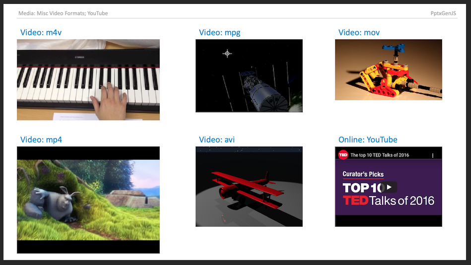

Media enables the addition of audio, video and online video to Slides.

## Usage

```typescript
// Path: full or relative
slide.addMedia({ type: "video", path: "https://example.com/media/sample.mov" });
slide.addMedia({ type: "video", path: "../media/sample.mov" });

// Base64: pre-encoded string
slide.addMedia({ type: "audio", data: "audio/mp3;base64,iVtDafDrBF[...]=" });

// YouTube: Online video (supported in Microsoft 365)
slide.addMedia({ type: "online", link: "https://www.youtube.com/embed/Dph6ynRVyUc" });
```

### Usage Notes

Either provide a URL location or base64 data along with type to create media.

-   `type` - type: media type
-   `path` - URL: relative or full
-   `data` - base64: string representing an encoded image

### Supported Formats and Notes

-   Video (mpg, mov, mp4, m4v, et al.); Audio (mp3, wav, et al.); (see [Video and Audio file formats supported in PowerPoint](https://support.office.com/en-us/article/Video-and-audio-file-formats-supported-in-PowerPoint-d8b12450-26db-4c7b-a5c1-593d3418fb59#OperatingSystem=Windows))
-   YouTube videos can be viewed using Microsoft 365/Office 365 (they may show errors on older desktop PowerPoint versions)
-   Other online video sites may be supported as well (some users have reported non-YouTube sites that worked)
-   Not all platforms support all formats! MacOS can show MPG files whereas Windows probably will not, and some AVI
    files may work and some may not. Video codecs are weird and painful like that.

## Properties

### Position/Size Props ([PositionProps](/PptxGenJS/docs/types#position-props))

| Option | Type   | Default | Description            | Possible Values                              |
| :----- | :----- | :------ | :--------------------- | :------------------------------------------- |
| `x`    | number | `1.0`   | hor location (inches)  | 0-n                                          |
| `x`    | string |         | hor location (percent) | 'n%'. (Ex: `{x:'50%'}` middle of the Slide)  |
| `y`    | number | `1.0`   | ver location (inches)  | 0-n                                          |
| `y`    | string |         | ver location (percent) | 'n%'. (Ex: `{y:'50%'}` middle of the Slide)  |
| `w`    | number | `1.0`   | width (inches)         | 0-n                                          |
| `w`    | string |         | width (percent)        | 'n%'. (Ex: `{w:'50%'}` 50% the Slide width)  |
| `h`    | number | `1.0`   | height (inches)        | 0-n                                          |
| `h`    | string |         | height (percent)       | 'n%'. (Ex: `{h:'50%'}` 50% the Slide height) |

### Data/Path Props ([DataOrPathProps](/PptxGenJS/docs/types#datapath-props-dataorpathprops))

| Option | Type   | Description         | Possible Values                                             |
| :----- | :----- | :------------------ | :---------------------------------------------------------- |
| `data` | string | image data (base64) | (`data` or `path` is required) base64-encoded image string. |
| `path` | string | image path          | (`data` or `path` is required) relative or full URL         |

### Media Props ([MediaProps](/PptxGenJS/docs/types#media-props-mediaprops))

| Option  | Type   | Description     | Possible Values                                                                         |
| :------ | :----- | :-------------- | :-------------------------------------------------------------------------------------- |
| `type`  | string | media type      | media type: `audio` or `video` (reqs: `data` or `path`) or `online` (reqs:`link`)       |
| `cover` | string | cover image     | base64 encoded string of cover image                                                    |
| `extn`  | string | media extension | use when the media file path does not already have an extension, ex: "/folder/SomeSong" |
| `link`  | string | video URL       | (YouTube only): link to online video                                                    |

## Example



## Samples

Sample code: [demos/modules/demo_media.mjs](https://github.com/gitbrent/PptxGenJS/blob/master/demos/modules/demo_media.mjs)
