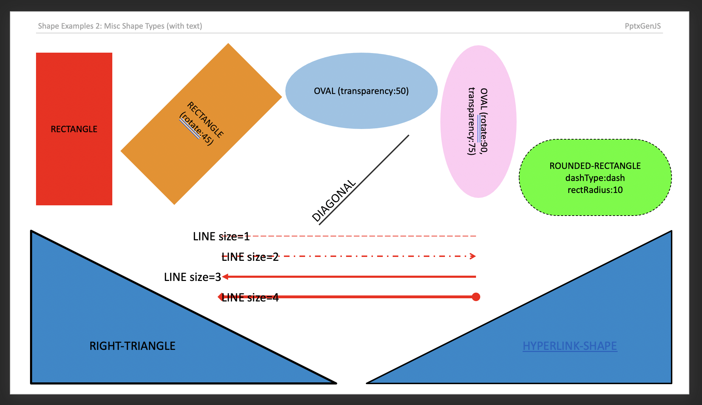

Almost 200 shape types can be added to Slides (see [`ShapeType`](https://github.com/gitbrent/PptxGenJS/blob/master/types/index.d.ts) enum).

## Usage

```typescript
// Shapes without text
slide.addShape(pres.ShapeType.rect, { fill: { color: "FF0000" } });
slide.addShape(pres.ShapeType.ellipse, {
  fill: { type: "solid", color: "0088CC" },
});
slide.addShape(pres.ShapeType.line, { line: { color: "FF0000", width: 1 } });

// Shapes with text
slide.addText("ShapeType.rect", {
  shape: pres.ShapeType.rect,
  fill: { color: "FF0000" },
});
slide.addText("ShapeType.ellipse", {
  shape: pres.ShapeType.ellipse,
  fill: { color: "FF0000" },
});
slide.addText("ShapeType.line", {
  shape: pres.ShapeType.line,
  line: { color: "FF0000", width: 1, dashType: "lgDash" },
});
```

## Properties

### Position/Size Props ([PositionProps](/PptxGenJS/docs/types#position-props))

| Name | Type   | Default | Description            | Possible Values                              |
| :--- | :----- | :------ | :--------------------- | :------------------------------------------- |
| `x`  | number | `1.0`   | hor location (inches)  | 0-n                                          |
| `x`  | string |         | hor location (percent) | 'n%'. (Ex: `{x:'50%'}` middle of the Slide)  |
| `y`  | number | `1.0`   | ver location (inches)  | 0-n                                          |
| `y`  | string |         | ver location (percent) | 'n%'. (Ex: `{y:'50%'}` middle of the Slide)  |
| `w`  | number | `1.0`   | width (inches)         | 0-n                                          |
| `w`  | string |         | width (percent)        | 'n%'. (Ex: `{w:'50%'}` 50% the Slide width)  |
| `h`  | number | `1.0`   | height (inches)        | 0-n                                          |
| `h`  | string |         | height (percent)       | 'n%'. (Ex: `{h:'50%'}` 50% the Slide height) |

### Shape Props ([ShapeProps](/PptxGenJS/docs/types#shape-props-shapeprops))

| Name         | Type                                                                    | Description         | Possible Values                                             |
| :----------- | :---------------------------------------------------------------------- | :------------------ | :---------------------------------------------------------- |
| `align`      | string                                                                  | alignment           | `left` or `center` or `right`. Default: `left`              |
| `fill`       | [ShapeFillProps](/PptxGenJS/docs/types#fill-props-shapefillprops)       | fill props          | Fill color/transparency props                               |
| `flipH`      | boolean                                                                 | flip Horizontal     | `true` or `false`                                           |
| `flipV`      | boolean                                                                 | flip Vertical       | `true` or `false`                                           |
| `hyperlink`  | [HyperlinkProps](/PptxGenJS/docs/types#hyperlink-props-hyperlinkprops)  | hyperlink props     | (see type link)                                             |
| `line`       | [ShapeLineProps](/PptxGenJS/docs/types#shape-line-props-shapelineprops) | border line props   | (see type link)                                             |
| `rectRadius` | number                                                                  | rounding radius     | 0 to 1. (Ex: 0.5. Only for `pptx.shapes.ROUNDED_RECTANGLE`) |
| `rotate`     | number                                                                  | rotation (degrees)  | -360 to 360. Default: `0`                                   |
| `shadow`     | [ShadowProps](/PptxGenJS/docs/types#shadow-props-shadowprops)           | shadow props        | (see type link)                                             |
| `shapeName`  | string                                                                  | optional shape name | Ex: "Customer Network Diagram 99"                           |

## Examples



## Samples

Sample code all available types: [demos/modules/demo_shape.mjs](https://github.com/gitbrent/PptxGenJS/blob/master/demos/modules/demo_shape.mjs)
