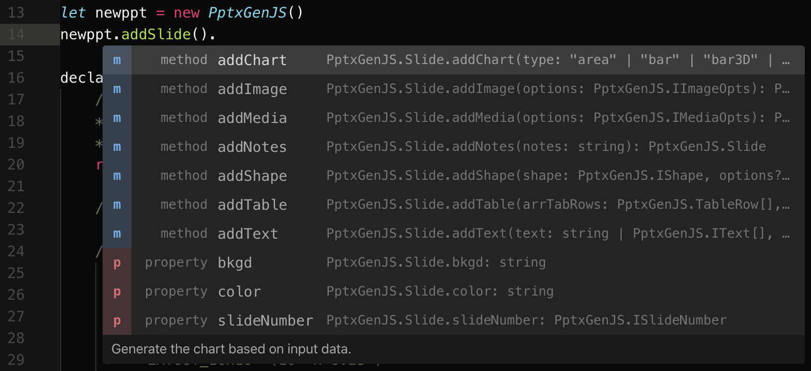

## Create a PowerPoint in 4 easy steps

PptxGenJS PowerPoint presentations are created by following 4 basic steps. See examples below by environment.

That's really all there is to it!

## Node-Based Applications

```tsx title="HelloWorld.ts"
import pptxgen from "pptxgenjs";

// 1. Create a Presentation
let pres = new pptxgen();

// 2. Add a Slide to the presentation
let slide = pres.addSlide();

// 3. Add 1+ objects (Tables, Shapes, etc.) to the Slide
let textboxText = "Hello World from PptxGenJS!";
let textboxOpts = { x: 1, y: 1, color: "363636" };
slide.addText(textboxText, textboxOpts);

// 4. Save the Presentation
pres.writeFile({ fileName: "Hello-World.pptx" });
```

### TypeScript Support

Modern application developers using ES6 with Angular, React, TypeScript, etc. benefit from full typescript defs.

Learn as you code in a modern development with included TypeScript definitions the documentation comes to you.



Develop your apps quickly without needing to look up documentation.


## Client Web Browser

```javascript title="HelloWorld.js"
// 1. Create a new Presentation
let pres = new PptxGenJS();

// 2. Add a Slide
let slide = pres.addSlide();

// 3. Add one or more objects (Tables, Shapes, Images, Text and Media) to the Slide
let textboxText = "Hello World from PptxGenJS!";
let textboxOpts = { x: 1, y: 1, color: "363636" };
slide.addText(textboxText, textboxOpts);

// 4. Save the Presentation
pres.writeFile({ fileName: "Hello-World.pptx" });
```
