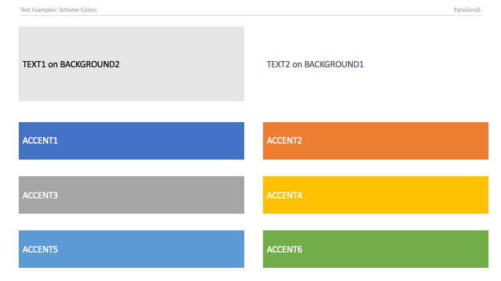

## PowerPoint Shape Types

The library comes with over 180 built-in PowerPoint shapes (thanks to [officegen project](https://github.com/Ziv-Barber/officegen)).

- Use inline typescript definitions to view available shapes
- or see `ShapeType` in [index.d.ts](https://github.com/gitbrent/PptxGenJS/blob/master/types/index.d.ts) for the complete list

## PowerPoint Scheme Colors

Scheme color is a variable that changes its value whenever another scheme palette is selected. Using scheme colors, design consistency can be easily preserved throughout the presentation and viewers can change color theme without any text/background contrast issues.

- Use inline typescript definitions to view available colors
- or see `SchemeColor` in [index.d.ts](https://github.com/gitbrent/PptxGenJS/blob/master/types/index.d.ts) for the complete list

To use a scheme color, set a color constant as a property value:

```javascript
slide.addText("Scheme Color 'text1'", { color: pptx.SchemeColor.text1 });
```

See the [Shapes Demo](https://gitbrent.github.io/PptxGenJS/demo/#shapes) for Scheme Colors demo



```typescript
export enum SchemeColor {
    "text1" = "tx1",
    "text2" = "tx2",
    "background1" = "bg1",
    "background2" = "bg2",
    "accent1" = "accent1",
    "accent2" = "accent2",
    "accent3" = "accent3",
    "accent4" = "accent4",
    "accent5" = "accent5",
    "accent6" = "accent6",
}
```
